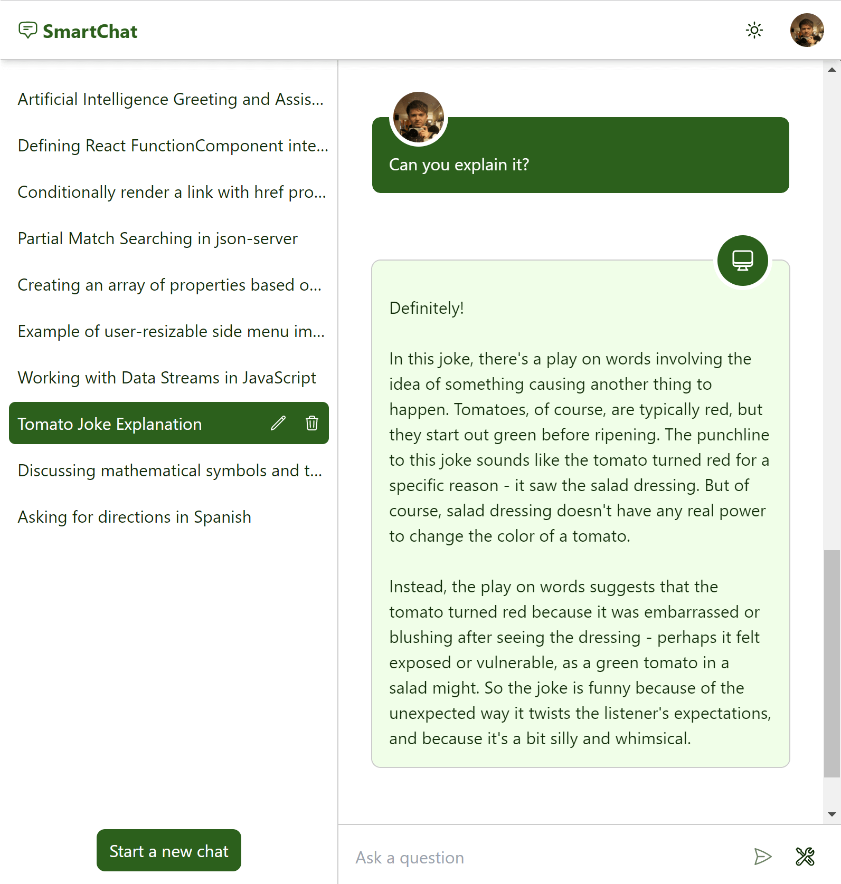

# SmartChat



This is a chat application that uses the OpenAI chat API. It is built using `Next.js`, `React`, and `Prisma` for database management. The app also utilizes various other dependencies including `Axios` and `TailwindCSS`.

## Features

The SmartChat app has the following features:

- Login and registration using Clerk for authentication.
- User profiles and account management using Prisma.
- Real-time chat using the OpenAI chat API.
- Auto-generated conversation titles that can be edited by users.
- Conversation encryption before saving to the database.
- Markdown support for text formatting.
- Click-away listener for closing menus and modals.
- Dark and light mode.
- UI language options for Russian and English.

### Themes

The SmartChat app supports two themes: dark and light mode. Users can switch between themes by clicking on the theme switcher in the app header.

### Conversations

The SmartChat app generates conversation titles automatically based on the content of the conversation. Users can edit the conversation title if they wish.

Conversations are encrypted before they are saved to the database to ensure the security and privacy of user data. The encryption and decryption process is handled using the Cryptr library.

## Getting Started

To get started with the SmartChat app, follow the instructions below:

1. Clone the repository.
2. Install dependencies using `npm install`.
3. Create a `.env` and `.env.local`.
4. Run the development server using `npm run dev`.

## Environment Variables

The following environment variables are required to run SmartChat:

`.env.local`:

```env
OPEN_AI_API_KEY= #The API key for the OpenAI chat API.
CLERK_SECRET_KEY= #The secret key for Clerk.
CRYPTR_KEY= #A secret key used to encrypt and decrypt conversation data.
NEXT_PUBLIC_CLERK_PUBLISHABLE_KEY= #The publishable key for Clerk.
```

`.env`:

```env
DATABASE_URL= #Your database url
```

## Dependencies

The following dependencies were used in the development of the SmartChat app:

- [@clerk/nextjs](https://docs.clerk.dev/getting-started/nextjs) - For authentication and user management.
- [@prisma/client](https://www.prisma.io/docs/concepts/components/prisma-client) - For database management.
- [axios](https://axios-http.com/) - For making HTTP requests.
- [next](https://nextjs.org/) - For server-side rendering and routing.
- [openai](https://beta.openai.com/docs/api-reference/introduction) - For real-time chat using OpenAI's chat API.
- [react](https://reactjs.org/) - For building user interfaces.
- [react-click-away-listener](https://www.npmjs.com/package/react-click-away-listener) - For detecting clicks outside a specific component.
- [react-dom](https://reactjs.org/docs/react-dom.html) - For DOM-specific methods.
- [react-markdown](https://github.com/remarkjs/react-markdown) - For rendering Markdown syntax.
- [typescript](https://www.typescriptlang.org/) - For adding static type checking.
- [tailwindcss](https://tailwindcss.com/) - For building responsive user interfaces.
- [cryptr](https://github.com/EnetoJara/cryptr) - For encryption and decryption of user data.
